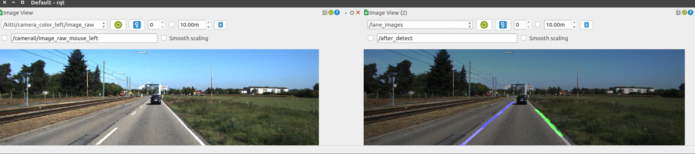

# LaneNet Ros Node

This project is modified from the lanenet-lane-detection project(see: https://github.com/MaybeShewill-CV/lanenet-lane-detection)

Here I use lanenet-lane-detection project to implement a Ros node to do lane detection. Input and output parameters can be config at launch file.

### Dependencies

Install the dependencies as lanenet-lane-detection metioned:

```
pip install -r requirements.txt
```

Then you need to install the ROS kinetic.

That's all.


### launch the node
In you catkin workspace `src` dir, clone the project:
```
git clone https://github.com/AbangLZU/LaneNetRos.git
```

download the pretrained weight(trained by @MaybeShewill-CV) in: https://www.dropbox.com/sh/tnsf0lw6psszvy4/AAA81r53jpUI3wLsRW6TiPCya?dl=0

copy these checkpoints files to the foler:
```
cd model
mkdir tusimple_lanenet
cd tusimple_lanenet
cp -r YOU_DOWNLOAD_FILES .
```
build and source (in the workspace)

```
catkin_make
sorce devel/setup.bash
```

you may need to change the mode of the python script, as follow:
```
cd lane_detector/scripts/
sudo chmod +x lanenet_node.py
```

Then you can launch the lane detector node with:
```
roslaunch lane_detector lanenet.launch
```

play one of you rosbag which contains the images, I use the KITTI dataset, which can be download at: http://www.cvlibs.net/datasets/kitti/raw_data.php?type=road

Download any drive data as you want (the `synced+rectified data` amd `calibration`), use tomas789's project `kitti2bag` (see: https://github.com/tomas789/kitti2bag) to convert it to a rosbag.

Use the following command to play the bag:

```
rosbag play kitti_2011_??????????.bag
```

Open your RQT to visualize the output, assign the image topic as you set in the launch file, and you should get this:



See more in this video:

[](https://www.youtube.com/watch?v=PzUpx1DSZ6E)

It's almost realtime in my GTX1070. If you think this work is useful to you, please both star this repository and the lanenet-lane-detection repository. THX!


### Future works 
* Implement the Curve Fitting of the lane with a C++ node.
* Retrain the LaneNet, improve its performance
* TensorRT optimization